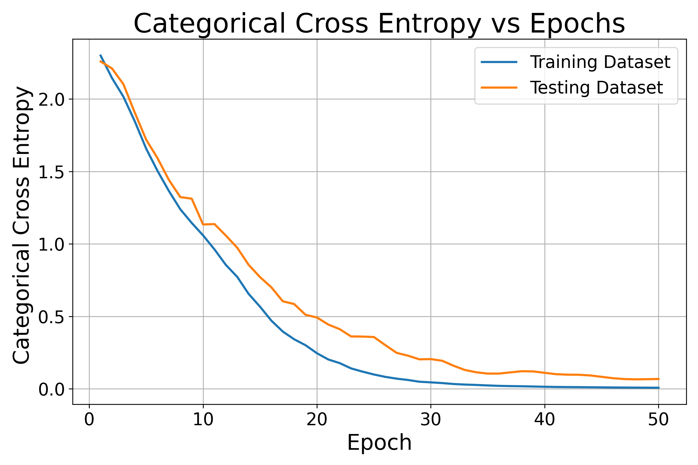
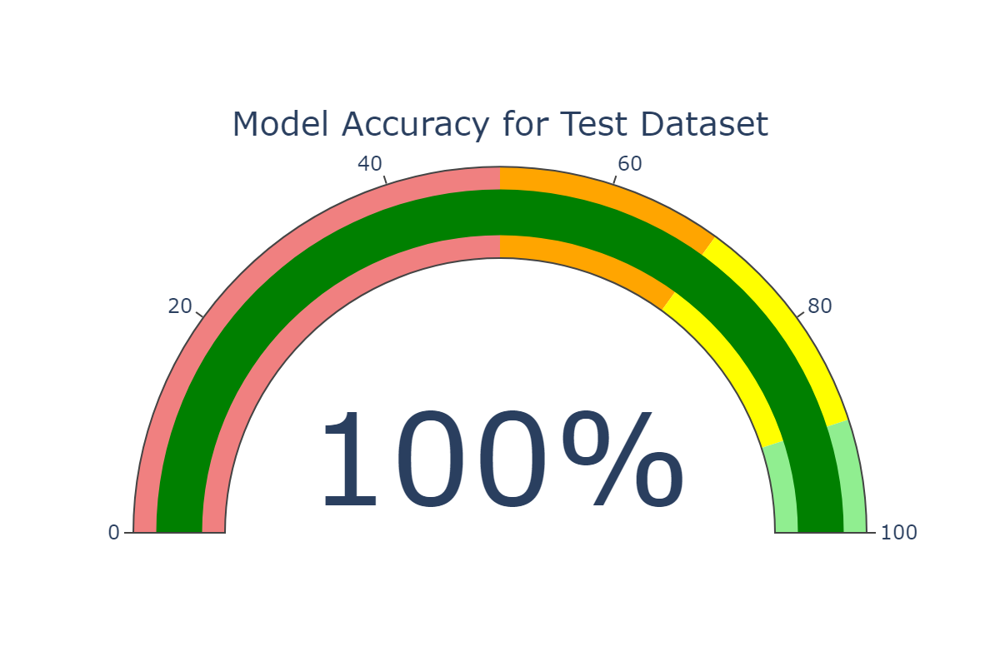
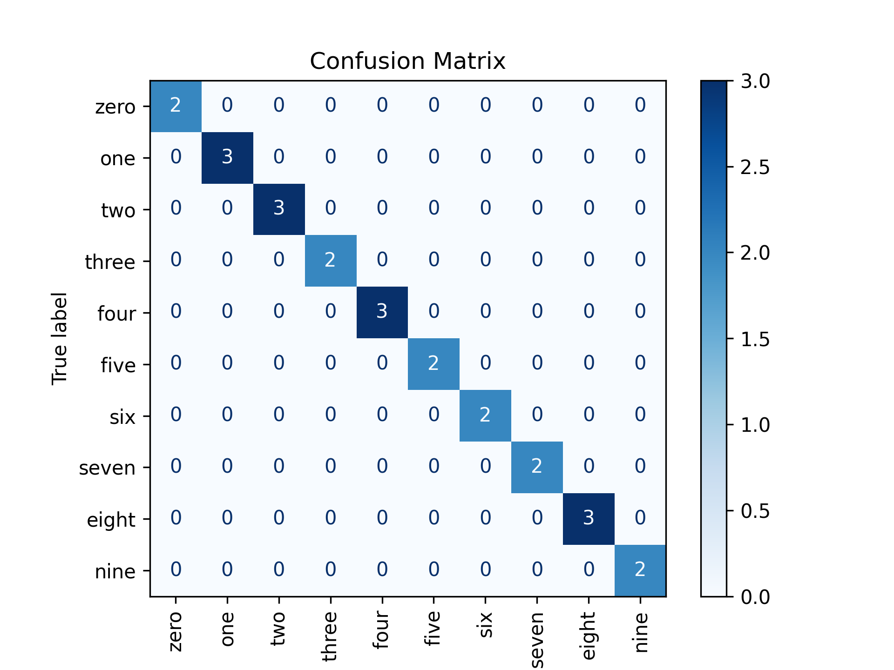

# Digit Recognition System

This project implements a digit recognition system from scratch that processes audio files to identify spoken digits from 0 to 9. Utilizing a custom Recurrent Neural Network (RNN) architecture, the model leverages digital signal processing techniques to transform audio signals into features suitable for classification.

## Dataset Overview

The dataset consists of **120 audio files**, categorized into:

- **Training Dataset**: 96 audio files (80% of the total)
- **Testing Dataset**: 24 audio files (20% of the total)
- **Audio File Format**: WAV
- **Sampling Frequency**: 8 kHz
- **Length per File**: Approximately 1 second
- **Total Features**: 14 (13 Mel Frequency Cepstral Coefficients (MFCCs) + 1 Zero-Crossing Rate (ZCR))
- **Total Classes**: 10 (Digits 0 to 9)

### Digital Signal Processing Parameters

- **Frame Length**: 256 samples (32 ms)
- **Hop Length**: 128 samples (16 ms)
- **Total Frames per File**: 59

This structured approach to framing allows us to efficiently extract features from the audio signals, facilitating better model training and performance.

## Hyperparameters

To achieve optimal results, we fine-tuned the following hyperparameters:

- **RNN Layers**: 1
- **RNN Activation Function**: tanh
- **Output Activation Function**: Softmax
- **Loss Function**: Categorical Cross Entropy (CCE)
- **Number of Neurons**: 256
- **Sequence Length**: 59
- **Learning Rate**: 0.001
- **Optimizer**: Adam
- **Epochs**: 50

These parameters were chosen to balance model complexity and performance, ensuring that our system learns effectively without overfitting.

## Performance Results

The model demonstrated impressive results, showcasing its effectiveness in recognizing digits:

- **Training Dataset Accuracy**: 100.00% 
- **Training Dataset Loss (CCE)**: 0.0074
- **Testing Dataset Accuracy**: 100%
- **Testing Dataset Loss (CCE)**: 0.0679

### Confusion Matrix 

### Classification Report

| Digit | Precision | Recall | F1-Score | Support |
|-------|-----------|--------|----------|---------|
| 0     | 1.00      | 1.00   | 1.00     | 2       |
| 1     | 1.00      | 1.00   | 1.00     | 3       |
| 2     | 1.00      | 1.00   | 1.00     | 3       |
| 3     | 1.00      | 1.00   | 1.00     | 2       |
| 4     | 1.00      | 1.00   | 1.00     | 3       |
| 5     | 1.00      | 1.00   | 1.00     | 2       |
| 6     | 1.00      | 1.00   | 1.00     | 2       |
| 7     | 1.00      | 1.00   | 1.00     | 2       |
| 8     | 1.00      | 1.00   | 1.00     | 3       |
| 9     | 1.00      | 1.00   | 1.00     | 2       |

- **Overall Accuracy**: 100.00%
- **Macro Average Precision**: 1.00
- **Macro Average Recall**: 1.00
- **Macro Average F1-Score**: 1.00

These metrics reflect the model's robustness and its capacity to generalize well to unseen data.

## Conclusion

This Digit Recognition System effectively demonstrates the application of RNNs in audio signal processing and achieved a high level of accuracy on both training and testing datasets.
